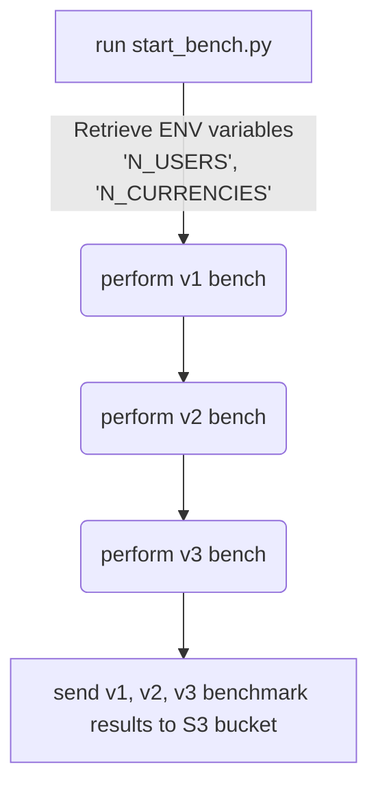

# Summa Bencher

This tool is designed to run benchmarks on multiple versions of Summa with specific configurations (such as `N_USERS`, `N_CURRENCIES`, and others) to compare their performance.

The scripts and benchmark code are specifically designed for execution on multiple AWS EC2 instances.

The benchmark results are collected in an S3 bucket, which requires AWS access credentials.

## Bencher Architecture

The system comprises two components: the benchmark code written in Rust, and the controlling script written in Python.

The script initiates sequencially the benchmarking code for multiple versions of Summa using subprocess, an external command. Each benchmark generates a result as a json file. At the end of the process, the script uploads these files to an S3 bucket.
